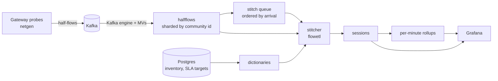

# Bank network intelligence

Service quality for a bank's branch network, measured from flow metadata. Probes send
half-flow records through Kafka into ClickHouse. A stitcher joins them into scored
sessions. Grafana shows which branches are degraded, what caused it, since when, and
which provider is responsible.

Live demo: [netdemo.ifeakande.com](https://netdemo.ifeakande.com), read-only, no login.
It runs on one EC2 instance and is up while the project is being reviewed.

## Why

Branches are rarely down. More often they are degraded: the circuit is up and ping is
green, but card payments at the ATMs are slow. This system measures every session (round
trip time, loss, time to first response) against the application's SLA and finds the
element causing the damage.

It uses metadata only: addresses, ports, byte and packet counts, handshake and first-byte
timestamps. No payloads, no decryption.

## Architecture



| Component | Role |
|---|---|
| `generator/` | Synthetic probes: 400 branches, 2,060 ATMs, 800 circuits, 3 providers, fault API |
| Kafka 4.3 (KRaft) | Transport between probes and the store |
| ClickHouse 26.8 | 2 shards × 2 replicas, 3 Keeper nodes |
| `etl/` | Schema migrations, inventory load, stitching |
| Postgres 18 | Inventory and SLA targets, read by ClickHouse dictionaries |
| Grafana 13 | 4 dashboards, 9 alert rules |

## Run it

```bash
make up      # creates .env.stack with random credentials, builds, starts
make test    # unit tests
make lint    # ruff, mypy --strict
make bench   # benchmarks on a separate ClickHouse server
make nuke    # remove everything
```

Dashboards: [estate](http://localhost:3000/d/bank-estate),
[fault localisation](http://localhost:3000/d/bank-localise),
[SLA evidence](http://localhost:3000/d/bank-sla),
[pipeline](http://localhost:3000/d/bank-pipeline).

Inject faults:

```bash
curl -XPOST localhost:8088/faults -d '{"kind":"degrade","target":"circuit:CKT-1035","latency_ms":40,"loss":0.03,"duration_s":300}'
curl -XPOST localhost:8088/faults -d '{"kind":"slow","target":"server:cas-02","server_factor":6,"duration_s":300}'
curl -XPOST localhost:8088/faults -d '{"kind":"down","target":"circuit:CKT-1153","duration_s":300}'
curl -XPOST localhost:8088/load   -d '{"factor":50}'
```

A schedule also injects five incidents every 45 minutes. Each fault is published as
ground truth so localisation can be checked against it.

## Design

### Stitching

Routing is asymmetric: the two directions of a session pass different probes, so RTT and
response time only exist after both halves are joined.

```
server RTT    = synack (s2c) - syn    (c2s)
client RTT    = ack    (c2s) - synack (s2c)
response time = first response (s2c) - first request (c2s)
```

- Half-flows are sharded by `cityHash64(community_id)`. Both halves land on the same
  shard, so stitching is local.
- A session is identified by Community ID plus each half's first-seen time, because
  5-tuples get reused.
- Halves are paired with an ASOF join that tolerates clock skew between probes.
- A session is written once: when both halves are complete (final record present, no gap
  in `record_seq`), or after 15 minutes without new records.
- Each shard reads its work queue by arrival time with its own watermark. Windows are
  checked again at +60 s, +300 s and +900 s to catch late deliveries.
- Re-running any window is safe. `flowetl restitch --since … --until …` fills gaps in a
  past range.

### Scoring

Postgres holds branches, circuits, devices, servers and SLA targets. ClickHouse
dictionaries read them and every session is enriched in the stitch query.

- Quality (0 to 100): response time 40%, WAN RTT 40%, loss 20%, against the app's targets.
- `degraded`: quality below 70.
- `net_degraded`: the network path failed (RTT, loss or no return traffic). Used for
  provider SLA; a slow server does not count.

### Localisation

A rollup maps each session onto every element on its path (switch, router, circuit, PoP,
provider, gateway, server, app). Each element is scored by precision (share of its
sessions that are degraded) and coverage (share of all degraded sessions it carries).
The highest score is the likely cause. Elements that carry the same sessions, such as a
router and its circuit, tie.

### Ingest safety

Kafka materialized views use conversions that cannot throw. Invalid records go to
`ingest_errors` with a reason. A single bad message can't stop a consumer.

## Benchmarks

`make bench`: 100M synthetic sessions over 3 days, loaded into each schema variant. Each
query runs 5 times with the query cache and query condition cache disabled; the median
is reported. ClickHouse 26.8, one server, 5 GB Docker container on a laptop. Raw results:
[`bench/results.json`](bench/results.json).

| Test | Before | After | Faster |
|---|---|---|---|
| Sort key: one branch, one day | `ORDER BY session_start`: 125 ms, 33.3M rows | `ORDER BY (branch_id, session_start)`: 4 ms, 98k rows | 31× |
| Dashboard panel: one day by minute | raw sessions: 279 ms | per-minute rollup: 39 ms | 7× |
| Schema types: full scan | first draft (`Nullable(String)`, no codecs, no sort key): 511 ms, 7.5 GB on disk | `LowCardinality`, Delta/T64 + ZSTD: 321 ms, 4.2 GB on disk | 1.6× |
| SLA view: one circuit, 3 days | no projection: 38 ms, 100M rows | projection by circuit: 4 ms, 270k rows | 9.5× |
| Lookup by session id | no index: 239 ms, 1.7 GB read | bloom filter: 12 ms, 19.5 MB read | 20× |

Ingest at 10× load (5 minutes, live cluster):

| Metric | Value |
|---|---|
| Records ingested | 1,090 rows/s (from 72 at simulated night-time traffic) |
| Session freshness | p50 21 s, p95 27 s, p99 29 s |
| Stitch lag | 16 s |
| Stitch time per window | 0.2 s every 10 s |
| Active parts per partition | 4 at most |

Ingest ceiling on the deployed instance (t4g.xlarge, 4 vCPU, whole stack on one box),
load stepped up through the generator's control API:

| Load | Peak ingest | Stitch lag | Replica delay |
|---|---|---|---|
| 100× | 1,340 rows/s | 19 to 25 s | 0 s |
| 200× | 2,860 rows/s | 19 to 26 s | 0 s |
| 400×, held 5 minutes | 7,900 rows/s | 20 to 35 s | 0 s |
| Kafka backlog drain | 15,000 rows/s | | |

The pipeline was not saturated at 400×, the highest step run. The backlog figure is the
rate ClickHouse drained a Kafka backlog after a stall, so it is a burst rate.

Tuning notes:

- The branch-first sort key also compresses 13% better than time-first.
- Rollups need density: at 2M rows the rollup was nearly as large as the raw table; at
  100M it is 5.3× smaller.
- Raising the Kafka flush interval from 2 s to 7.5 s cut time spent writing parts from
  440 s to 3.5 s per 150 s.
- The stitcher only loops without waiting when it has a backlog. This cut its CPU by 5.7×.
- The query condition cache makes repeated scans look instant. It is disabled for all
  measurements.
- Keeper at 256 MB sat at 225 MB resident on arm64, crossed its soft limit under load
  and refused requests. Every replicated table went read-only for 2.5 minutes. At
  512 MB the same run shows no refusals.

## Dashboards and alerts

Dashboards and alert rules are generated by `grafana/build.py`. CI fails if the committed
JSON differs from the source.

- Estate: reachability next to quality, degradation by criticality, ranked branches,
  quality timeline.
- Fault localisation: likely cause, ranked candidates, injected incidents.
- Provider SLA: degraded and outage minutes charged to the branch's primary circuit. Loss
  on a bank switch is excluded when another switch at the branch is healthy.
- Pipeline: ingest rate, stitch lag, replica delay, quarantined records, storage.

Alert rules:

| Service | Platform |
|---|---|
| Branch network degraded | Stitcher falling behind |
| Fault localised | ClickHouse replica down |
| Card authorisation slow | ClickHouse replication delay |
| Branch running on backup circuit | Records quarantined at ingest |
| | Ingestion stopped |

Alerts target causes. A slow central server raises one alert, not one per branch. Each
rule was tested by injecting the failure and confirming it fired and cleared.

## Tests

- 53 unit tests: generator, fault validation, fault ids, control API, Kafka stall handling,
  migrations, stitch windows.
- 20 integration tests against the running stack, in CI:
  - replicas agree; no duplicate or lost sessions; every session enriched
  - an injected fault is localised to the right element
  - invalid records are quarantined and never reach the tables
  - every dashboard panel answers with each filter set to all, one and several values
  - every alert rule is healthy

## Security

- ClickHouse: default user disabled; separate `admin`, `etl` and read-only `grafana`
  users with hashed passwords. `grafana` has no `REMOTE`, no `query_log`, and limits on
  query time, memory and concurrency.
- Secrets live in `.env.stack` (gitignored). CI runs gitleaks on the full history.
- Local ports bind to `127.0.0.1`. The deployed instance has no inbound ports; Grafana is
  published through a Cloudflare Tunnel and shell access is through SSM.
- No long-lived cloud keys: Terraform Cloud and GitHub Actions get short-lived AWS
  credentials through OIDC.
- CI actions are pinned to commit SHAs; images are scanned before publishing.

## Deployment

Terraform in `infra/`, run by Terraform Cloud, built from terraform-aws-modules plus the
official Cloudflare provider for the tunnel.

- `infra/bootstrap`: OIDC trust for Terraform Cloud and GitHub Actions, applied once.
- `infra/live`: VPC with one public subnet and no NAT gateway, a security group with no
  inbound rules and outbound 443 and 7844 only, a t4g.xlarge with an encrypted gp3 disk
  and IMDSv2, the Cloudflare Tunnel and DNS record, a read-only deploy key for the repo,
  and a $30 monthly budget alert.
- First boot installs Docker and cloudflared from signed package repos and pinned,
  checksum-verified Compose and Buildx, clones the repo and runs `make up`. The tunnel token and deploy key come from SSM Parameter Store, not user data.

A merge to `main` runs CI, then the deploy workflow moves the instance to the new commit
over SSM. `terraform destroy` on the `bni-demo` workspace removes everything, including the
DNS record and the deploy key.

Checked on the live instance: every dashboard query and alert rule through the public
URL, each scheduled incident firing and clearing its alert, a deploy from `main`, and a
stop and start of the instance (site back in about a minute, no manual steps).

## Limitations

- Everything runs on one instance: the 2 × 2 cluster is real in configuration, but the
  replicas share one machine, so they add no capacity or fault tolerance. In production
  each server runs on its own machine, spread across availability zones. The schema and
  code stay the same; `clickhouse/config.d/cluster.xml` already addresses servers by
  hostname.
- Kafka runs as one broker. Production would use three with replication factor 3.
- Traffic is synthetic. It models RTT, loss, retransmission timeouts, asymmetric routing,
  port reuse, and late and duplicate delivery.
- Probes in the data centre cannot tell branch LAN loss from circuit loss when only one
  switch is active.
- Alerts appear in Grafana only; no contact point is configured.
- A TCP session with no return traffic is only written after the 15 minute idle timeout,
  so alerts see it late.
- Benchmarks compare designs on identical data on a laptop. They are not capacity figures.

## Layout

```
generator/   synthetic probes and fault API
etl/         migrations, inventory loader, stitcher
clickhouse/  cluster config, users, migrations, localisation query
postgres/    inventory schema and views
grafana/     dashboards and alerts as code
bench/       benchmark harness and results
infra/       terraform: bootstrap (OIDC trust) and live (the demo instance)
scripts/     secret generation, deploy
```
